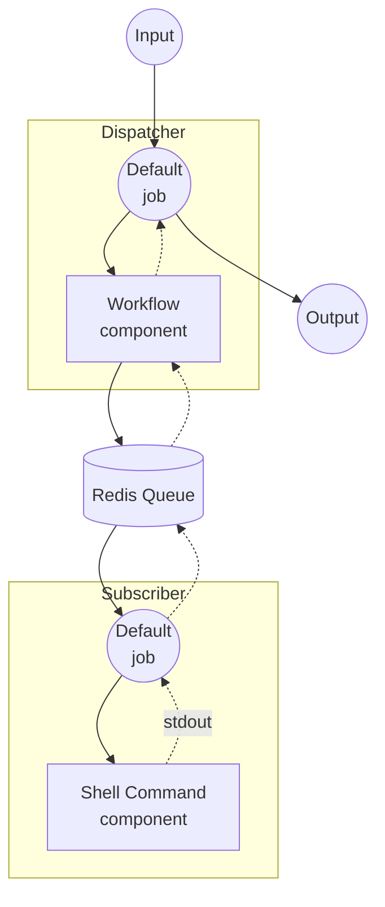

# Workflow Queue 示例

本示例演示如何使用 Redis 作为消息队列，将工作流执行分布到多个实例。Dispatcher 接收请求并将其转发到远程 Subscriber 进行处理。

## 概述

本示例由两个独立的实例组成：

1. **Dispatcher**：接收 HTTP 请求并将工作流任务分发到 Redis 队列
2. **Subscriber**：监听 Redis 队列，执行实际的工作流并返回结果

Dispatcher 使用 `workflow` 组件，通过 Redis 将 `echo` 工作流委派给 Subscriber，无需在本地定义该工作流。

## 准备工作

### 前置条件

- 已安装 model-compose 并添加到 PATH
- Redis 服务器在 localhost:6379 上运行

### Redis 设置

启动本地 Redis 服务器：
```bash
redis-server
```

或使用 Docker：
```bash
docker run -d --name redis -p 6379:6379 redis
```

## 运行方法

本示例需要运行两个独立的实例。

1. **启动 Subscriber**（在单独的终端中）：
   ```bash
   cd examples/workflow-queue/subscriber
   model-compose up
   ```

2. **启动 Dispatcher：**
   ```bash
   cd examples/workflow-queue/dispatcher
   model-compose up
   ```

3. **运行工作流：**

   **使用 API：**
   ```bash
   curl -X POST http://localhost:8080/api/workflows/runs \
     -H "Content-Type: application/json" \
     -d '{
       "input": {
         "text": "Hello from queue!"
       }
     }'
   ```

   **使用 Web UI：**
   - 打开 Web UI：http://localhost:8081
   - 输入文本
   - 点击 "Run Workflow" 按钮

   **使用 CLI：**
   ```bash
   cd examples/workflow-queue/dispatcher
   model-compose run --input '{"text": "Hello from queue!"}'
   ```

## 组件详情

### Dispatcher

#### Workflow 组件（默认）
- **类型**：Workflow 组件
- **用途**：通过 Redis 队列将工作流执行委派给远程工作节点
- **目标工作流**：`echo`（在 Subscriber 上远程解析）

### Subscriber

#### Shell 命令组件 (echo)
- **类型**：Shell 组件
- **用途**：使用提供的文本执行 echo 命令
- **命令**：`echo <text>`
- **输出**：通过 stdout 输出的回显文本

## 工作流详情

### Dispatcher："Echo via Queue" 工作流（默认）

**描述**：通过 Redis 队列将任务分发到远程工作节点。

#### 作业流程



#### 输入参数

| 参数 | 类型 | 必填 | 默认值 | 描述 |
|------|------|------|--------|------|
| `text` | text | 是 | - | 在远程工作节点上回显的文本 |

#### 输出格式

| 字段 | 类型 | 描述 |
|------|------|------|
| `text` | text | 从远程工作节点返回的回显文本 |

## 自定义

- **Redis 配置**：修改 Dispatcher 和 Subscriber 两侧的 `host`、`port` 或 `name` 以使用不同的 Redis 实例或队列名称
- **替换 Subscriber 工作流**：将 Shell 组件替换为其他组件（HTTP 客户端、模型等）以不同方式处理任务
- **扩展工作节点**：运行多个 Subscriber 实例以并行处理任务
- **添加工作流**：在 Subscriber 的 `workflows` 列表中注册更多工作流以处理不同的任务类型
