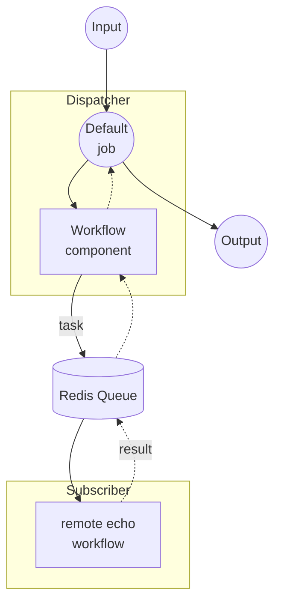

# Workflow Queue Dispatcher 예제

이 예제는 논스트리밍 workflow-queue 쌍의 Dispatcher 측 예제입니다. HTTP 요청을 받아 Redis 큐를 통해 각 작업을 원격 워커로 전달하고, 결과를 기다렸다가 단일 응답으로 반환합니다.

짝을 이루는 워커는 [`non-stream/subscriber`](../subscriber/README.ko.md) 예제로, 동일한 큐에서 `echo` 작업을 가져와 셸 명령으로 로컬에서 실행합니다.

## 개요

이 Dispatcher는 다음 과정으로 동작합니다:

1. **요청 수신**: HTTP 서버가 `text` 필드를 포함하는 POST 요청을 받습니다
2. **큐로 디스패치**: `workflow` 컴포넌트가 원격 `echo` 워크플로우를 `my-queue`라는 Redis 큐를 통해 Subscriber로 위임합니다
3. **결과 반환**: Subscriber의 응답이 JSON 응답으로 클라이언트에 전달됩니다

## 준비사항

### 필수 요구사항

- model-compose가 설치되어 PATH에 등록되어 있어야 합니다
- localhost:6379에서 Redis 서버가 실행 중이어야 합니다
- 동일한 Redis 큐에 연결된 짝 예제 [`non-stream/subscriber`](../subscriber/README.ko.md)가 실행 중이어야 합니다

### 환경 구성

환경 변수는 필요하지 않습니다.

### Redis 설정

로컬 Redis 서버를 시작합니다:
```bash
redis-server
```

또는 Docker를 사용합니다:
```bash
docker run -d --name redis -p 6379:6379 redis
```

## 실행 방법

1. **Subscriber 시작** (별도의 터미널에서, [`../subscriber/README.ko.md`](../subscriber/README.ko.md)의 지침을 따릅니다):
   ```bash
   cd ../subscriber
   model-compose up
   ```

2. **Dispatcher 시작:**
   ```bash
   model-compose up
   ```

3. **워크플로우 실행:**

   **API 사용:**
   ```bash
   curl -X POST http://localhost:8080/api/workflows/runs \
     -H "Content-Type: application/json" \
     -d '{
       "input": {
         "text": "Hello from queue!"
       }
     }'
   ```

   **Web UI 사용:**
   - Web UI 열기: http://localhost:8081
   - 텍스트를 입력합니다
   - "Run Workflow" 버튼을 클릭합니다

   **CLI 사용:**
   ```bash
   model-compose run --input '{"text": "Hello from queue!"}'
   ```

## 컴포넌트 세부사항

### Workflow 컴포넌트 (기본)
- **유형**: `workflow` 컴포넌트
- **용도**: Redis 큐를 통해 원격 `echo` 워크플로우로 실행을 위임
- **대상 워크플로우**: `echo` (Subscriber에서 해석 및 실행)
- **입력**: `text` (text)
- **출력**: `{ text: ${output.text as text} }`

컨트롤러는 Redis 기반 큐로 구성됩니다:

```yaml
controller:
  adapter:
    type: http-server
    port: 8080
    base_path: /api
  queue:
    driver: redis
    host: localhost
    port: 6379
    name: my-queue
```

## 워크플로우 세부사항

### "Echo via Queue" 워크플로우 (기본)

**설명**: Redis 큐를 통해 원격 워커로 작업을 디스패치하고 에코된 텍스트를 반환합니다.

#### 작업 흐름



#### 입력 매개변수

| 매개변수 | 유형 | 필수 | 기본값 | 설명 |
|---------|------|------|-------|------|
| `text` | text | 예 | - | 원격 워커에서 에코할 텍스트 |

#### 출력 형식

| 필드 | 유형 | 설명 |
|------|------|------|
| `text` | text | 원격 워커에서 반환된 에코된 텍스트 |

## 예제 출력

`"Hello from queue!"`를 입력하면 클라이언트는 다음을 받습니다:

```json
{
  "text": "Hello from queue!\n"
}
```

끝의 줄바꿈은 Subscriber의 `echo` 셸 명령에서 발생합니다.

## 사용자 정의

- **Redis 설정**: `controller.queue`의 `host`, `port`, `name`을 변경 (Subscriber와 일치해야 함)
- **대상 워크플로우**: `workflow` 컴포넌트의 `action.workflow`를 변경하여 Subscriber에 등록된 다른 원격 워크플로우로 라우팅
- **Base Path / Port**: `controller.adapter.base_path` 또는 `port`를 조정하여 다른 엔드포인트로 API 노출
- **Web UI**: `controller.webui.port`를 변경하거나 해당 블록을 제거하여 Gradio UI 비활성화
