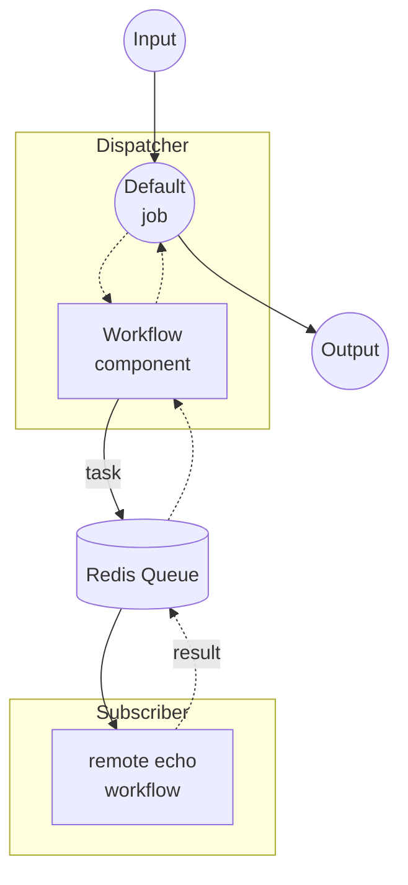

# Workflow Queue Dispatcher Example

This example is the dispatcher half of the non-streaming workflow-queue pair. It accepts HTTP requests, forwards each task to a remote worker via a Redis queue, waits for the result, and returns it in a single response.

The paired worker is the [`non-stream/subscriber`](../subscriber/README.md) example, which pulls `echo` tasks off the same queue and executes them locally with a shell command.

## Overview

This dispatcher operates through the following process:

1. **Receive Request**: The HTTP server accepts a POST containing a `text` field
2. **Dispatch to Queue**: A `workflow` component delegates the remote `echo` workflow to the subscriber via the Redis queue named `my-queue`
3. **Return Result**: The subscriber's response is relayed back to the client as a JSON response

## Preparation

### Prerequisites

- model-compose installed and available in your PATH
- Redis server running on localhost:6379
- The paired [`non-stream/subscriber`](../subscriber/README.md) example running and connected to the same Redis queue

### Environment Configuration

No environment variables are required.

### Redis Setup

Start a local Redis server:
```bash
redis-server
```

Or using Docker:
```bash
docker run -d --name redis -p 6379:6379 redis
```

## How to Run

1. **Start the subscriber** (in a separate terminal), following the instructions in [`../subscriber/README.md`](../subscriber/README.md):
   ```bash
   cd ../subscriber
   model-compose up
   ```

2. **Start the dispatcher:**
   ```bash
   model-compose up
   ```

3. **Run the workflow:**

   **Using API:**
   ```bash
   curl -X POST http://localhost:8080/api/workflows/runs \
     -H "Content-Type: application/json" \
     -d '{
       "input": {
         "text": "Hello from queue!"
       }
     }'
   ```

   **Using Web UI:**
   - Open the Web UI: http://localhost:8081
   - Enter your text
   - Click the "Run Workflow" button

   **Using CLI:**
   ```bash
   model-compose run --input '{"text": "Hello from queue!"}'
   ```

## Component Details

### Workflow Component (Default)
- **Type**: `workflow` component
- **Purpose**: Delegates execution to the remote `echo` workflow via the Redis queue
- **Target Workflow**: `echo` (resolved and executed on the subscriber)
- **Input**: `text` (text)
- **Output**: `{ text: ${output.text as text} }`

The controller is configured with a Redis-backed queue:

```yaml
controller:
  adapter:
    type: http-server
    port: 8080
    base_path: /api
  queue:
    driver: redis
    host: localhost
    port: 6379
    name: my-queue
```

## Workflow Details

### "Echo via Queue" Workflow (Default)

**Description**: Dispatches a task to a remote worker through the Redis queue and returns the echoed text.

#### Job Flow



#### Input Parameters

| Parameter | Type | Required | Default | Description |
|-----------|------|----------|---------|-------------|
| `text` | text | Yes | - | The text to echo on the remote worker |

#### Output Format

| Field | Type | Description |
|-------|------|-------------|
| `text` | text | The echoed text returned from the remote worker |

## Example Output

For an input of `"Hello from queue!"`, the client receives:

```json
{
  "text": "Hello from queue!\n"
}
```

The trailing newline comes from the subscriber's `echo` shell command.

## Customization

- **Redis Configuration**: Change `host`, `port`, or `name` under `controller.queue` (must match the subscriber)
- **Target Workflow**: Change `action.workflow` in the `workflow` component to route to a different remote workflow registered by the subscriber
- **Base Path / Port**: Adjust `controller.adapter.base_path` or `port` to expose the API on a different endpoint
- **Web UI**: Change `controller.webui.port`, or remove the block to disable the Gradio UI
