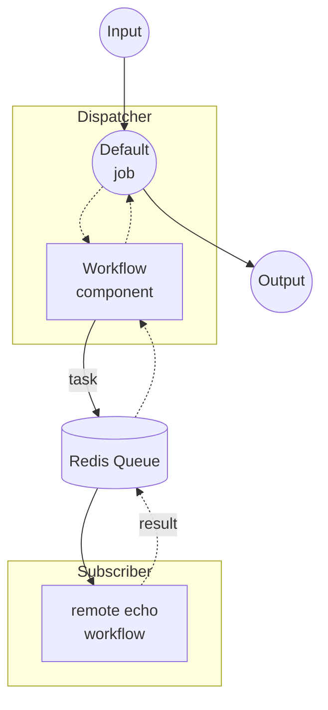

# Workflow Queue Dispatcher 示例

本示例是非流式 workflow-queue 组合的 Dispatcher 端。它接收 HTTP 请求，通过 Redis 队列将每个任务转发到远程工作节点，等待结果并以单一响应返回。

配对的工作节点是 [`non-stream/subscriber`](../subscriber/README.zh-cn.md) 示例，它从同一队列拉取 `echo` 任务，并使用 shell 命令在本地执行。

## 概述

本 Dispatcher 通过以下流程运行：

1. **接收请求**：HTTP 服务器接受包含 `text` 字段的 POST 请求
2. **分发到队列**：`workflow` 组件通过名为 `my-queue` 的 Redis 队列将远程 `echo` 工作流委派给 Subscriber
3. **返回结果**：Subscriber 的响应以 JSON 响应形式转发给客户端

## 准备工作

### 前置条件

- 已安装 model-compose 并添加到 PATH
- Redis 服务器在 localhost:6379 上运行
- 已运行配对的 [`non-stream/subscriber`](../subscriber/README.zh-cn.md) 示例并连接到同一 Redis 队列

### 环境配置

不需要环境变量。

### Redis 设置

启动本地 Redis 服务器：
```bash
redis-server
```

或使用 Docker：
```bash
docker run -d --name redis -p 6379:6379 redis
```

## 运行方式

1. **启动 Subscriber**（在单独的终端中，按照 [`../subscriber/README.zh-cn.md`](../subscriber/README.zh-cn.md) 的说明）：
   ```bash
   cd ../subscriber
   model-compose up
   ```

2. **启动 Dispatcher：**
   ```bash
   model-compose up
   ```

3. **运行工作流：**

   **使用 API：**
   ```bash
   curl -X POST http://localhost:8080/api/workflows/runs \
     -H "Content-Type: application/json" \
     -d '{
       "input": {
         "text": "Hello from queue!"
       }
     }'
   ```

   **使用 Web UI：**
   - 打开 Web UI：http://localhost:8081
   - 输入文本
   - 点击 "Run Workflow" 按钮

   **使用 CLI：**
   ```bash
   model-compose run --input '{"text": "Hello from queue!"}'
   ```

## 组件详情

### Workflow 组件（默认）
- **类型**：`workflow` 组件
- **用途**：通过 Redis 队列将执行委派给远程 `echo` 工作流
- **目标工作流**：`echo`（在 Subscriber 上解析并执行）
- **输入**：`text` (text)
- **输出**：`{ text: ${output.text as text} }`

控制器配置为 Redis 队列：

```yaml
controller:
  adapter:
    type: http-server
    port: 8080
    base_path: /api
  queue:
    driver: redis
    host: localhost
    port: 6379
    name: my-queue
```

## 工作流详情

### "Echo via Queue" 工作流（默认）

**描述**：通过 Redis 队列将任务分发到远程工作节点，并返回回显的文本。

#### 作业流程



#### 输入参数

| 参数 | 类型 | 必需 | 默认值 | 描述 |
|------|------|------|--------|------|
| `text` | text | 是 | - | 在远程工作节点上要回显的文本 |

#### 输出格式

| 字段 | 类型 | 描述 |
|------|------|------|
| `text` | text | 从远程工作节点返回的回显文本 |

## 示例输出

对于输入 `"Hello from queue!"`，客户端收到：

```json
{
  "text": "Hello from queue!\n"
}
```

末尾的换行来自 Subscriber 的 `echo` shell 命令。

## 自定义

- **Redis 配置**：修改 `controller.queue` 下的 `host`、`port` 或 `name`（必须与 Subscriber 一致）
- **目标工作流**：修改 `workflow` 组件中的 `action.workflow`，以路由到 Subscriber 上注册的其他远程工作流
- **Base Path / Port**：调整 `controller.adapter.base_path` 或 `port`，将 API 暴露在不同端点
- **Web UI**：修改 `controller.webui.port`，或删除该块以禁用 Gradio UI
