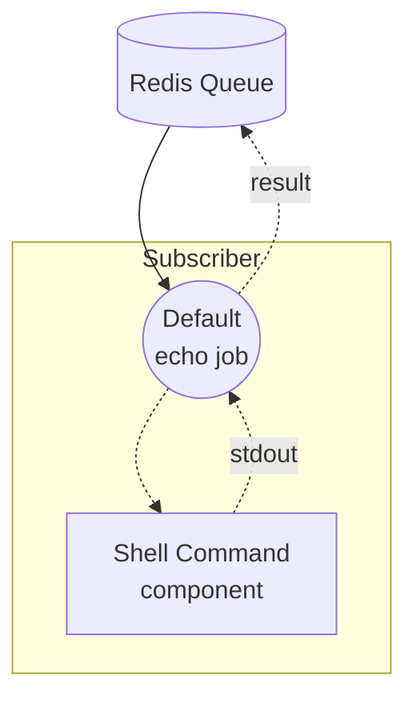

# Workflow Queue Subscriber 예제

이 예제는 논스트리밍 workflow-queue 쌍의 Subscriber 측 예제입니다. Redis 큐에서 `echo` 작업을 수신하고, 입력 텍스트로 로컬 `echo` 셸 명령을 실행한 뒤 결과를 큐를 통해 반환합니다.

짝을 이루는 Dispatcher는 [`non-stream/dispatcher`](../dispatcher/README.ko.md) 예제로, HTTP 요청을 받아 동일한 큐에 작업을 게시합니다.

## 개요

이 Subscriber는 다음 과정으로 동작합니다:

1. **큐 대기**: `queue-subscriber` 컨트롤러가 Redis 큐 `my-queue`를 구독하고 `echo` 워크플로우를 등록합니다
2. **셸 명령 실행**: 작업이 도착하면 `echo` 셸 컴포넌트가 로컬에서 `echo <text>`를 실행합니다
3. **결과 반환**: 명령의 stdout이 캡처되어 큐를 통해 Dispatcher로 다시 전달됩니다

## 준비사항

### 필수 요구사항

- model-compose가 설치되어 PATH에 등록되어 있어야 합니다
- localhost:6379에서 Redis 서버가 실행 중이어야 합니다
- HTTP 요청을 받을 수 있도록 짝 예제 [`non-stream/dispatcher`](../dispatcher/README.ko.md)가 준비되어 있어야 합니다

### 환경 구성

환경 변수는 필요하지 않습니다.

### Redis 설정

로컬 Redis 서버를 시작합니다:
```bash
redis-server
```

또는 Docker를 사용합니다:
```bash
docker run -d --name redis -p 6379:6379 redis
```

## 실행 방법

1. **Subscriber 시작:**
   ```bash
   model-compose up
   ```

2. **Dispatcher 시작** (별도의 터미널에서, [`../dispatcher/README.ko.md`](../dispatcher/README.ko.md)의 지침을 따릅니다):
   ```bash
   cd ../dispatcher
   model-compose up
   ```

3. **Dispatcher를 통해 요청 전송** — `curl`, Web UI, CLI 예시는 [`../dispatcher/README.ko.md`](../dispatcher/README.ko.md)를 참고하세요. Subscriber에는 자체 HTTP 엔드포인트가 없으며 큐에서 가져온 작업만 처리합니다.

## 컴포넌트 세부사항

### 셸 명령 컴포넌트 (echo)
- **유형**: `shell` 컴포넌트
- **용도**: 입력 텍스트로 `echo` 명령을 실행
- **명령**: `[ "echo", "${input.text}" ]`
- **출력**: `{ text: ${result.stdout} }` — 캡처된 표준 출력

컨트롤러는 Redis 큐 Subscriber로 구성됩니다:

```yaml
controller:
  adapter:
    type: queue-subscriber
    driver: redis
    host: localhost
    port: 6379
    name: my-queue
    workflows:
      - echo
```

## 워크플로우 세부사항

### "Echo via Queue" 워크플로우 (`echo`)

**설명**: Redis 큐에서 수신된 작업을 셸 `echo` 명령으로 처리하고 stdout을 반환합니다.

#### 작업 흐름



#### 입력 매개변수

| 매개변수 | 유형 | 필수 | 기본값 | 설명 |
|---------|------|------|-------|------|
| `text` | text | 예 | - | 에코할 텍스트 |

#### 출력 형식

| 필드 | 유형 | 설명 |
|------|------|------|
| `text` | text | `echo <text>`가 생성한 stdout |

## 예제 출력

`"Hello from queue!"`를 입력하면 Subscriber는 다음을 반환합니다:

```json
{
  "text": "Hello from queue!\n"
}
```

끝의 줄바꿈은 `echo` 명령에 의해 추가됩니다.

## 사용자 정의

- **Redis 설정**: `controller.adapter`의 `host`, `port`, `name`을 변경 (Dispatcher와 일치해야 함)
- **등록된 워크플로우**: 추가 작업 유형을 처리하려면 `controller.adapter.workflows`에 워크플로우 ID를 추가
- **셸 컴포넌트 교체**: `echo` 컴포넌트를 다른 컴포넌트(HTTP 클라이언트, 모델 등)로 교체하여 작업을 다른 방식으로 처리
- **워커 확장**: 동일한 큐에 대해 여러 Subscriber 인스턴스를 실행하여 작업을 병렬로 처리
