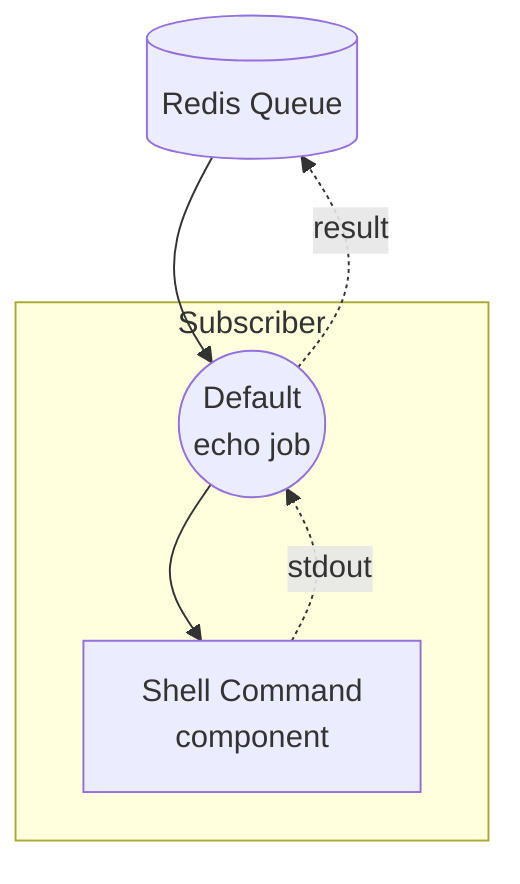

# Workflow Queue Subscriber Example

This example is the subscriber half of the non-streaming workflow-queue pair. It listens on a Redis queue for `echo` tasks, executes a local `echo` shell command with the incoming text, and returns the result through the queue.

The paired dispatcher is the [`non-stream/dispatcher`](../dispatcher/README.md) example, which accepts HTTP requests and pushes tasks onto the same queue.

## Overview

This subscriber operates through the following process:

1. **Listen on Queue**: The `queue-subscriber` controller subscribes to the Redis queue `my-queue` and registers the `echo` workflow
2. **Execute Shell Command**: When a task arrives, the `echo` shell component runs `echo <text>` locally
3. **Return Result**: The command's stdout is captured and returned back through the queue for the dispatcher to relay

## Preparation

### Prerequisites

- model-compose installed and available in your PATH
- Redis server running on localhost:6379
- The paired [`non-stream/dispatcher`](../dispatcher/README.md) example available to receive HTTP requests

### Environment Configuration

No environment variables are required.

### Redis Setup

Start a local Redis server:
```bash
redis-server
```

Or using Docker:
```bash
docker run -d --name redis -p 6379:6379 redis
```

## How to Run

1. **Start the subscriber:**
   ```bash
   model-compose up
   ```

2. **Start the dispatcher** (in a separate terminal), following the instructions in [`../dispatcher/README.md`](../dispatcher/README.md):
   ```bash
   cd ../dispatcher
   model-compose up
   ```

3. **Send a request through the dispatcher** — see [`../dispatcher/README.md`](../dispatcher/README.md) for `curl`, Web UI, and CLI examples. The subscriber has no HTTP endpoint of its own; it only processes tasks pulled from the queue.

## Component Details

### Shell Command Component (echo)
- **Type**: `shell` component
- **Purpose**: Runs an `echo` command with the incoming text
- **Command**: `[ "echo", "${input.text}" ]`
- **Output**: `{ text: ${result.stdout} }` — the captured standard output

The controller is configured as a Redis queue subscriber:

```yaml
controller:
  adapter:
    type: queue-subscriber
    driver: redis
    host: localhost
    port: 6379
    name: my-queue
    workflows:
      - echo
```

## Workflow Details

### "Echo via Queue" Workflow (`echo`)

**Description**: Processes tasks received from the Redis queue by running a shell `echo` command and returning its stdout.

#### Job Flow



#### Input Parameters

| Parameter | Type | Required | Default | Description |
|-----------|------|----------|---------|-------------|
| `text` | text | Yes | - | The text to echo |

#### Output Format

| Field | Type | Description |
|-------|------|-------------|
| `text` | text | The stdout produced by `echo <text>` |

## Example Output

For an input of `"Hello from queue!"`, the subscriber returns:

```json
{
  "text": "Hello from queue!\n"
}
```

The trailing newline is added by the `echo` command.

## Customization

- **Redis Configuration**: Change `host`, `port`, or `name` under `controller.adapter` (must match the dispatcher)
- **Registered Workflows**: Add more workflow IDs to `controller.adapter.workflows` to handle additional task types
- **Replace Shell Component**: Swap the `echo` component with any other component (HTTP client, model, etc.) to process tasks differently
- **Scale Workers**: Run multiple subscriber instances against the same queue to process tasks in parallel
