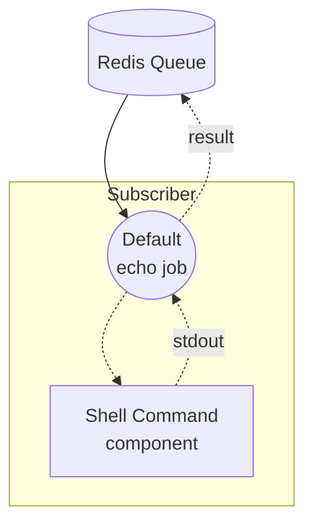

# Workflow Queue Subscriber 示例

本示例是非流式 workflow-queue 组合的 Subscriber 端。它在 Redis 队列上监听 `echo` 任务，使用接收到的文本在本地执行 `echo` shell 命令，并通过队列返回结果。

配对的 Dispatcher 是 [`non-stream/dispatcher`](../dispatcher/README.zh-cn.md) 示例，它接收 HTTP 请求并将任务推送到同一队列。

## 概述

本 Subscriber 通过以下流程运行：

1. **监听队列**：`queue-subscriber` 控制器订阅 Redis 队列 `my-queue` 并注册 `echo` 工作流
2. **执行 Shell 命令**：当任务到达时，`echo` shell 组件在本地运行 `echo <text>`
3. **返回结果**：命令的 stdout 被捕获并通过队列返回给 Dispatcher 转发

## 准备工作

### 前置条件

- 已安装 model-compose 并添加到 PATH
- Redis 服务器在 localhost:6379 上运行
- 已准备好配对的 [`non-stream/dispatcher`](../dispatcher/README.zh-cn.md) 示例以接收 HTTP 请求

### 环境配置

不需要环境变量。

### Redis 设置

启动本地 Redis 服务器：
```bash
redis-server
```

或使用 Docker：
```bash
docker run -d --name redis -p 6379:6379 redis
```

## 运行方式

1. **启动 Subscriber：**
   ```bash
   model-compose up
   ```

2. **启动 Dispatcher**（在单独的终端中，按照 [`../dispatcher/README.zh-cn.md`](../dispatcher/README.zh-cn.md) 的说明）：
   ```bash
   cd ../dispatcher
   model-compose up
   ```

3. **通过 Dispatcher 发送请求** — `curl`、Web UI 和 CLI 示例请参阅 [`../dispatcher/README.zh-cn.md`](../dispatcher/README.zh-cn.md)。Subscriber 没有自己的 HTTP 端点，仅处理从队列拉取的任务。

## 组件详情

### Shell 命令组件 (echo)
- **类型**：`shell` 组件
- **用途**：使用传入的文本运行 `echo` 命令
- **命令**：`[ "echo", "${input.text}" ]`
- **输出**：`{ text: ${result.stdout} }` — 捕获的标准输出

控制器配置为 Redis 队列 Subscriber：

```yaml
controller:
  adapter:
    type: queue-subscriber
    driver: redis
    host: localhost
    port: 6379
    name: my-queue
    workflows:
      - echo
```

## 工作流详情

### "Echo via Queue" 工作流 (`echo`)

**描述**：通过运行 shell `echo` 命令处理从 Redis 队列接收的任务，并返回其 stdout。

#### 作业流程



#### 输入参数

| 参数 | 类型 | 必需 | 默认值 | 描述 |
|------|------|------|--------|------|
| `text` | text | 是 | - | 要回显的文本 |

#### 输出格式

| 字段 | 类型 | 描述 |
|------|------|------|
| `text` | text | `echo <text>` 生成的 stdout |

## 示例输出

对于输入 `"Hello from queue!"`，Subscriber 返回：

```json
{
  "text": "Hello from queue!\n"
}
```

末尾的换行由 `echo` 命令添加。

## 自定义

- **Redis 配置**：修改 `controller.adapter` 下的 `host`、`port` 或 `name`（必须与 Dispatcher 一致）
- **注册的工作流**：向 `controller.adapter.workflows` 添加更多工作流 ID 以处理其他任务类型
- **替换 Shell 组件**：将 `echo` 组件替换为其他组件（HTTP 客户端、模型等），以不同方式处理任务
- **扩展工作节点**：针对同一队列运行多个 Subscriber 实例，以并行处理任务
