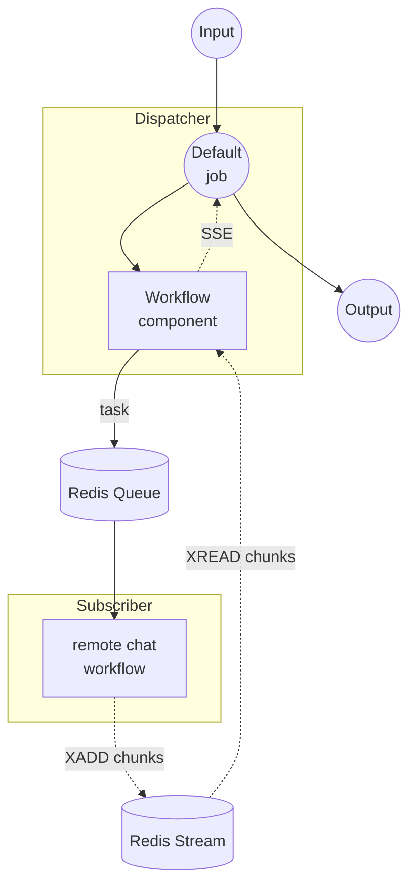

# Workflow Queue Stream Dispatcher Example

This example is the dispatcher half of the streaming workflow-queue pair. It accepts HTTP requests, forwards the task to a remote worker through a Redis queue, and streams the response back to the client as Server-Sent Events (SSE).

The paired worker is the [`stream/subscriber`](../subscriber/README.md) example, which pulls tasks off the same queue, calls the OpenAI streaming API, and writes chunks back through a Redis Stream.

## Overview

This dispatcher operates through the following process:

1. **Receive Request**: The HTTP server accepts a POST containing a `prompt`
2. **Dispatch to Queue**: A `workflow` component delegates the remote `chat` workflow to the subscriber via the Redis queue named `my-queue`
3. **Stream Response**: Chunks written by the subscriber to the Redis Stream are relayed back to the client as SSE

## Preparation

### Prerequisites

- model-compose installed and available in your PATH
- Redis server running on localhost:6379
- The paired [`stream/subscriber`](../subscriber/README.md) example running and connected to the same Redis queue

### Environment Configuration

No environment variables are required by the dispatcher itself. The `OPENAI_API_KEY` used by the OpenAI streaming API is configured on the subscriber side.

### Redis Setup

Start a local Redis server:
```bash
redis-server
```

Or using Docker:
```bash
docker run -d --name redis -p 6379:6379 redis
```

## How to Run

1. **Start the subscriber** (in a separate terminal), following the instructions in [`../subscriber/README.md`](../subscriber/README.md):
   ```bash
   cd ../subscriber
   model-compose up
   ```

2. **Start the dispatcher:**
   ```bash
   model-compose up
   ```

3. **Run the workflow:**

   **Using API (streaming):**
   ```bash
   curl -N -X POST http://localhost:8080/api/workflows/runs \
     -H "Content-Type: application/json" \
     -d '{
       "input": {
         "prompt": "Write a short poem about the sea."
       },
       "output_only": true,
       "wait_for_completion": true
     }'
   ```

   **Using Web UI:**
   - Open the Web UI: http://localhost:8081
   - Enter your prompt
   - Click the "Run Workflow" button

   **Using CLI:**
   ```bash
   model-compose run --input '{"prompt": "Write a short poem about the sea."}'
   ```

## Component Details

### Workflow Component (Default)
- **Type**: `workflow` component
- **Purpose**: Delegates execution to the remote `chat` workflow via the Redis queue
- **Target Workflow**: `chat` (resolved and executed on the subscriber)
- **Input**: `prompt` (text)
- **Output**: `${output as stream/text}` — relayed as a streamed text response

The controller is configured with a Redis-backed queue:

```yaml
controller:
  adapter:
    type: http-server
    port: 8080
    base_path: /api
  queue:
    driver: redis
    host: localhost
    port: 6379
    name: my-queue
```

## Workflow Details

### "Chat with OpenAI GPT-4o (Streaming via Queue)" Workflow (Default)

**Description**: Dispatches a chat task to a remote worker through the Redis queue and streams the response back to the client.

#### Job Flow



#### Input Parameters

| Parameter | Type | Required | Default | Description |
|-----------|------|----------|---------|-------------|
| `prompt` | text | Yes | - | The chat prompt to forward to the remote worker |

#### Output Format

Streamed as SSE (Server-Sent Events). Each event contains a text token produced by the remote subscriber.

## Example Output

Given the request above, the client receives a stream of SSE events, each carrying one token of the model response:

```
data: "The"
data: " sea"
data: " sings"
data: " of"
...
```

## Customization

- **Redis Configuration**: Change `host`, `port`, or `name` under `controller.queue` (must match the subscriber)
- **Target Workflow**: Change `action.workflow` in the `workflow` component to route to a different remote workflow registered by the subscriber
- **Base Path / Port**: Adjust `controller.adapter.base_path` or `port` to expose the API on a different endpoint
- **Web UI**: Change `controller.webui.port`, or remove the block to disable the Gradio UI
