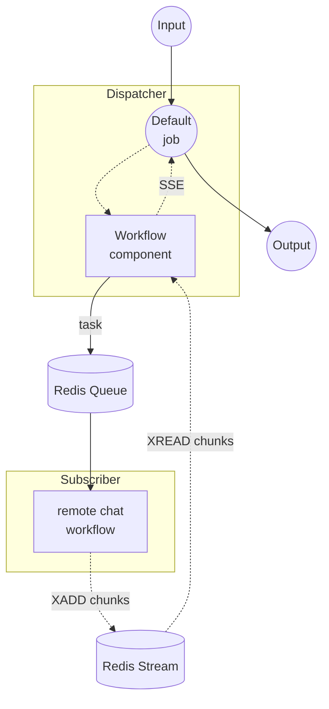

# Workflow Queue Stream Dispatcher 示例

本示例是流式 workflow-queue 组合的 Dispatcher 端。它接收 HTTP 请求，通过 Redis 队列将任务转发到远程工作节点，并将响应以 Server-Sent Events (SSE) 形式流式传输回客户端。

配对的工作节点是 [`stream/subscriber`](../subscriber/README.zh-cn.md) 示例，它从同一队列拉取任务，调用 OpenAI 流式 API，并通过 Redis Stream 写回数据块。

## 概述

本 Dispatcher 通过以下流程运行：

1. **接收请求**：HTTP 服务器接受包含 `prompt` 的 POST 请求
2. **分发到队列**：`workflow` 组件通过名为 `my-queue` 的 Redis 队列将远程 `chat` 工作流委派给 Subscriber
3. **流式响应**：Subscriber 写入 Redis Stream 的数据块以 SSE 形式转发到客户端

## 准备工作

### 前置条件

- 已安装 model-compose 并添加到 PATH
- Redis 服务器在 localhost:6379 上运行
- 已运行配对的 [`stream/subscriber`](../subscriber/README.zh-cn.md) 示例并连接到同一 Redis 队列

### 环境配置

Dispatcher 本身不需要环境变量。OpenAI 流式 API 所用的 `OPENAI_API_KEY` 在 Subscriber 端配置。

### Redis 设置

启动本地 Redis 服务器：
```bash
redis-server
```

或使用 Docker：
```bash
docker run -d --name redis -p 6379:6379 redis
```

## 运行方式

1. **启动 Subscriber**（在单独的终端中，按照 [`../subscriber/README.zh-cn.md`](../subscriber/README.zh-cn.md) 的说明）：
   ```bash
   cd ../subscriber
   model-compose up
   ```

2. **启动 Dispatcher：**
   ```bash
   model-compose up
   ```

3. **运行工作流：**

   **使用 API（流式）：**
   ```bash
   curl -N -X POST http://localhost:8080/api/workflows/runs \
     -H "Content-Type: application/json" \
     -d '{
       "input": {
         "prompt": "Write a short poem about the sea."
       },
       "output_only": true,
       "wait_for_completion": true
     }'
   ```

   **使用 Web UI：**
   - 打开 Web UI：http://localhost:8081
   - 输入提示词
   - 点击 "Run Workflow" 按钮

   **使用 CLI：**
   ```bash
   model-compose run --input '{"prompt": "Write a short poem about the sea."}'
   ```

## 组件详情

### Workflow 组件（默认）
- **类型**：`workflow` 组件
- **用途**：通过 Redis 队列将执行委派给远程 `chat` 工作流
- **目标工作流**：`chat`（在 Subscriber 上解析并执行）
- **输入**：`prompt` (text)
- **输出**：`${output as stream/text}` — 以文本流形式转发

控制器配置为 Redis 队列：

```yaml
controller:
  adapter:
    type: http-server
    port: 8080
    base_path: /api
  queue:
    driver: redis
    host: localhost
    port: 6379
    name: my-queue
```

## 工作流详情

### "Chat with OpenAI GPT-4o (Streaming via Queue)" 工作流（默认）

**描述**：通过 Redis 队列将聊天任务分发到远程工作节点，并将响应流式传输回客户端。

#### 作业流程



#### 输入参数

| 参数 | 类型 | 必需 | 默认值 | 描述 |
|------|------|------|--------|------|
| `prompt` | text | 是 | - | 转发到远程工作节点的聊天提示词 |

#### 输出格式

以 SSE (Server-Sent Events) 形式流式传输。每个事件包含由远程 Subscriber 生成的文本令牌。

## 示例输出

针对上述请求，客户端接收到一系列 SSE 事件流，每个事件携带模型响应的一个令牌：

```
data: "The"
data: " sea"
data: " sings"
data: " of"
...
```

## 自定义

- **Redis 配置**：修改 `controller.queue` 下的 `host`、`port` 或 `name`（必须与 Subscriber 一致）
- **目标工作流**：修改 `workflow` 组件中的 `action.workflow`，以路由到 Subscriber 上注册的其他远程工作流
- **Base Path / Port**：调整 `controller.adapter.base_path` 或 `port`，将 API 暴露在不同端点
- **Web UI**：修改 `controller.webui.port`，或删除该块以禁用 Gradio UI
