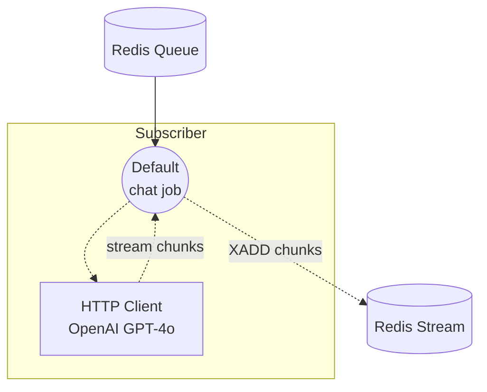

# Workflow Queue Stream Subscriber 예제

이 예제는 스트리밍 workflow-queue 쌍의 Subscriber 측 예제입니다. Redis 큐에서 `chat` 작업을 수신하고, OpenAI GPT-4o 채팅 완성 API를 스트리밍 모드로 호출한 뒤 각 토큰 청크를 Redis Stream에 기록하여 Dispatcher가 클라이언트로 중계할 수 있도록 합니다.

짝을 이루는 Dispatcher는 [`stream/dispatcher`](../dispatcher/README.ko.md) 예제로, HTTP 요청을 받아 동일한 큐에 작업을 게시하고, 반환되는 청크를 Server-Sent Events (SSE)로 스트리밍합니다.

## 개요

이 Subscriber는 다음 과정으로 동작합니다:

1. **큐 대기**: `queue-subscriber` 컨트롤러가 Redis 큐 `my-queue`를 구독하고 `chat` 워크플로우를 등록합니다
2. **OpenAI 호출**: 작업이 도착하면 `openai` HTTP 클라이언트 컴포넌트가 `stream: true`로 호출됩니다
3. **청크 스트리밍**: 토큰 청크가 JSON (`stream_format: json`)으로 파싱되어 Redis Stream을 통해 Dispatcher로 되돌아갑니다

## 준비사항

### 필수 요구사항

- model-compose가 설치되어 PATH에 등록되어 있어야 합니다
- localhost:6379에서 Redis 서버가 실행 중이어야 합니다
- OpenAI API 키
- HTTP 요청을 받을 수 있도록 짝 예제 [`stream/dispatcher`](../dispatcher/README.ko.md)가 준비되어 있어야 합니다

### 환경 구성

`.env.sample`을 `.env`로 복사하고 키를 입력합니다:

```bash
cp .env.sample .env
```

그런 다음 `.env`를 편집합니다:

```
OPENAI_API_KEY=sk-...
```

또는 실행 전에 셸에서 변수를 내보낼 수 있습니다:

```bash
export OPENAI_API_KEY=sk-...
```

### Redis 설정

로컬 Redis 서버를 시작합니다:
```bash
redis-server
```

또는 Docker를 사용합니다:
```bash
docker run -d --name redis -p 6379:6379 redis
```

## 실행 방법

1. **Subscriber 시작:**
   ```bash
   model-compose up
   ```

2. **Dispatcher 시작** (별도의 터미널에서, [`../dispatcher/README.ko.md`](../dispatcher/README.ko.md)의 지침을 따릅니다):
   ```bash
   cd ../dispatcher
   model-compose up
   ```

3. **Dispatcher를 통해 요청 전송** — `curl`, Web UI, CLI 예시는 [`../dispatcher/README.ko.md`](../dispatcher/README.ko.md)를 참고하세요. Subscriber에는 자체 HTTP 엔드포인트가 없으며 큐에서 가져온 작업만 처리합니다.

## 컴포넌트 세부사항

### HTTP 클라이언트 컴포넌트 (openai)
- **유형**: `http-client` 컴포넌트
- **Base URL**: `https://api.openai.com/v1`
- **용도**: OpenAI GPT-4o 채팅 완성 API를 스트리밍 모드로 호출
- **Action**:
  - `path`: `/chat/completions`
  - `method`: `POST`
  - `body.model`: `gpt-4o`
  - `body.stream`: `true`
  - `stream_format`: `json`
- **출력**: `${response[].choices[0].delta.content}` — 스트리밍된 각 delta 토큰을 추출

컨트롤러는 Redis 큐 Subscriber로 구성됩니다:

```yaml
controller:
  adapter:
    type: queue-subscriber
    driver: redis
    host: localhost
    port: 6379
    name: my-queue
    workflows:
      - chat
```

## 워크플로우 세부사항

### "Chat with OpenAI GPT-4o (Streaming)" 워크플로우 (`chat`)

**설명**: Redis 큐에서 수신된 채팅 작업을 처리하고 모델 응답을 Redis Stream을 통해 다시 스트리밍합니다.

#### 작업 흐름



#### 입력 매개변수

| 매개변수 | 유형 | 필수 | 기본값 | 설명 |
|---------|------|------|-------|------|
| `prompt` | text | 예 | - | GPT-4o에 보낼 채팅 프롬프트 |

#### 출력 형식

스트리밍된 출력의 각 요소는 `response[].choices[0].delta.content`에서 추출한 텍스트 토큰입니다. 워크플로우의 `output`은 `${output as stream/text}`로 선언되어 있어, 청크가 Redis Stream을 통해 텍스트 스트림으로 Dispatcher에 전달됩니다.

## 예제 출력

`"Write a short poem about the sea."`와 같은 프롬프트에 대해 Subscriber는 다음과 같은 청크를 기록합니다:

```
"The"
" sea"
" sings"
" of"
...
```

이 청크는 Dispatcher가 소비하여 SSE 이벤트로 HTTP 클라이언트에 전달합니다.

## 사용자 정의

- **모델**: `openai` 컴포넌트의 `body.model`을 변경 (예: `gpt-4o-mini`)
- **프로바이더**: `openai` HTTP 클라이언트를 다른 스트리밍 지원 프로바이더(Anthropic, 로컬 vLLM 등)로 교체하면서 `stream_format: json`을 유지하고 응답 스키마에 맞게 `output` JSONPath를 조정
- **Redis 설정**: `controller.adapter`의 `host`, `port`, `name`을 변경 (Dispatcher와 일치해야 함)
- **등록된 워크플로우**: 추가 작업 유형을 처리하려면 `controller.adapter.workflows`에 워크플로우 ID를 추가
- **워커 확장**: 동일한 큐에 대해 여러 Subscriber 인스턴스를 실행하여 동시 요청을 병렬로 처리
