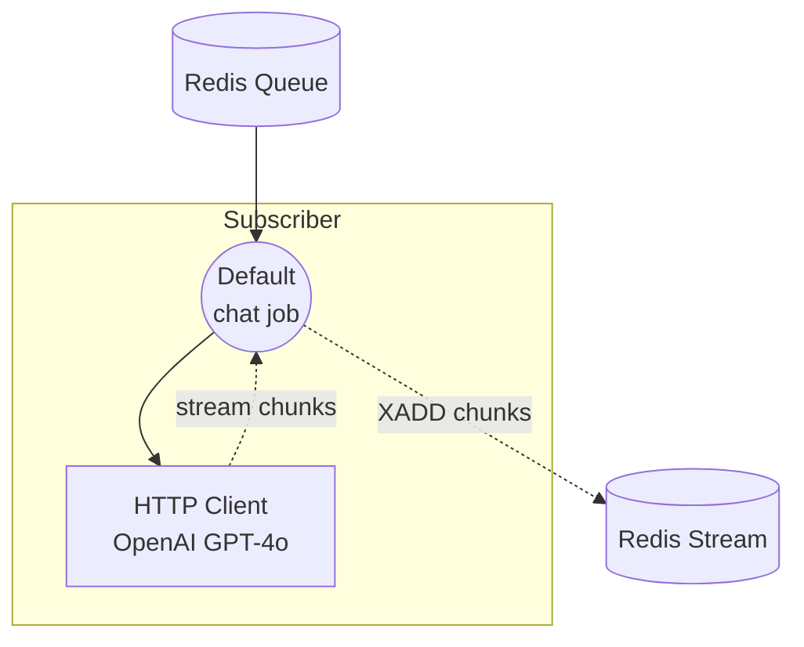

# Workflow Queue Stream Subscriber Example

This example is the subscriber half of the streaming workflow-queue pair. It listens on a Redis queue for `chat` tasks, calls the OpenAI GPT-4o chat completions API with streaming enabled, and writes each token chunk back through a Redis Stream so the dispatcher can relay them to the client.

The paired dispatcher is the [`stream/dispatcher`](../dispatcher/README.md) example, which accepts HTTP requests, pushes tasks onto the same queue, and streams the returning chunks as Server-Sent Events (SSE).

## Overview

This subscriber operates through the following process:

1. **Listen on Queue**: The `queue-subscriber` controller subscribes to the Redis queue `my-queue` and registers the `chat` workflow
2. **Call OpenAI**: When a task arrives, the `openai` HTTP client component is invoked with `stream: true`
3. **Stream Chunks**: Token chunks are parsed as JSON (`stream_format: json`) and pushed back through the Redis Stream to the dispatcher

## Preparation

### Prerequisites

- model-compose installed and available in your PATH
- Redis server running on localhost:6379
- An OpenAI API key
- The paired [`stream/dispatcher`](../dispatcher/README.md) example available to receive HTTP requests

### Environment Configuration

Copy `.env.sample` to `.env` and fill in your key:

```bash
cp .env.sample .env
```

Then edit `.env`:

```
OPENAI_API_KEY=sk-...
```

Alternatively, export the variable in your shell before running:

```bash
export OPENAI_API_KEY=sk-...
```

### Redis Setup

Start a local Redis server:
```bash
redis-server
```

Or using Docker:
```bash
docker run -d --name redis -p 6379:6379 redis
```

## How to Run

1. **Start the subscriber:**
   ```bash
   model-compose up
   ```

2. **Start the dispatcher** (in a separate terminal), following the instructions in [`../dispatcher/README.md`](../dispatcher/README.md):
   ```bash
   cd ../dispatcher
   model-compose up
   ```

3. **Send a request through the dispatcher** — see [`../dispatcher/README.md`](../dispatcher/README.md) for `curl`, Web UI, and CLI examples. The subscriber has no HTTP endpoint of its own; it only processes tasks pulled from the queue.

## Component Details

### HTTP Client Component (openai)
- **Type**: `http-client` component
- **Base URL**: `https://api.openai.com/v1`
- **Purpose**: Calls OpenAI GPT-4o chat completions with streaming enabled
- **Action**:
  - `path`: `/chat/completions`
  - `method`: `POST`
  - `body.model`: `gpt-4o`
  - `body.stream`: `true`
  - `stream_format`: `json`
- **Output**: `${response[].choices[0].delta.content}` — extracts each streamed delta token

The controller is configured as a Redis queue subscriber:

```yaml
controller:
  adapter:
    type: queue-subscriber
    driver: redis
    host: localhost
    port: 6379
    name: my-queue
    workflows:
      - chat
```

## Workflow Details

### "Chat with OpenAI GPT-4o (Streaming)" Workflow (`chat`)

**Description**: Processes chat tasks received from the Redis queue and streams the model response back through a Redis Stream.

#### Job Flow



#### Input Parameters

| Parameter | Type | Required | Default | Description |
|-----------|------|----------|---------|-------------|
| `prompt` | text | Yes | - | The chat prompt to send to GPT-4o |

#### Output Format

Each element of the streamed output is a text token extracted from `response[].choices[0].delta.content`. The workflow's `output` is declared as `${output as stream/text}`, so the chunks are relayed as a text stream via the Redis Stream to the dispatcher.

## Example Output

For a prompt like `"Write a short poem about the sea."`, the subscriber writes chunks such as:

```
"The"
" sea"
" sings"
" of"
...
```

These are consumed by the dispatcher and forwarded to the HTTP client as SSE events.

## Customization

- **Model**: Change `body.model` in the `openai` component (e.g., `gpt-4o-mini`)
- **Provider**: Replace the `openai` HTTP client with any other streaming-capable provider (Anthropic, local vLLM, etc.), keeping `stream_format: json` and adjusting the `output` JSONPath to match its response schema
- **Redis Configuration**: Change `host`, `port`, or `name` under `controller.adapter` (must match the dispatcher)
- **Registered Workflows**: Add more workflow IDs to `controller.adapter.workflows` to handle additional task types
- **Scale Workers**: Run multiple subscriber instances against the same queue to process concurrent requests in parallel
