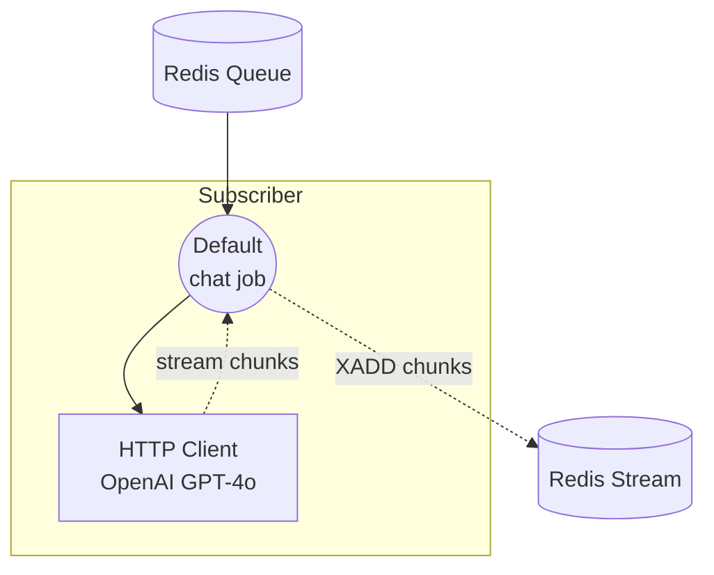

# Workflow Queue Stream Subscriber 示例

本示例是流式 workflow-queue 组合的 Subscriber 端。它在 Redis 队列上监听 `chat` 任务，以流式模式调用 OpenAI GPT-4o 聊天补全 API，并通过 Redis Stream 写回每个令牌数据块，供 Dispatcher 转发给客户端。

配对的 Dispatcher 是 [`stream/dispatcher`](../dispatcher/README.zh-cn.md) 示例，它接收 HTTP 请求，将任务推送到同一队列，并将返回的数据块以 Server-Sent Events (SSE) 形式流式传输。

## 概述

本 Subscriber 通过以下流程运行：

1. **监听队列**：`queue-subscriber` 控制器订阅 Redis 队列 `my-queue` 并注册 `chat` 工作流
2. **调用 OpenAI**：当任务到达时，以 `stream: true` 调用 `openai` HTTP 客户端组件
3. **流式数据块**：令牌数据块以 JSON (`stream_format: json`) 解析，并通过 Redis Stream 推回给 Dispatcher

## 准备工作

### 前置条件

- 已安装 model-compose 并添加到 PATH
- Redis 服务器在 localhost:6379 上运行
- OpenAI API 密钥
- 已准备好配对的 [`stream/dispatcher`](../dispatcher/README.zh-cn.md) 示例以接收 HTTP 请求

### 环境配置

将 `.env.sample` 复制为 `.env` 并填写您的密钥：

```bash
cp .env.sample .env
```

然后编辑 `.env`：

```
OPENAI_API_KEY=sk-...
```

或者，在运行前在 shell 中导出该变量：

```bash
export OPENAI_API_KEY=sk-...
```

### Redis 设置

启动本地 Redis 服务器：
```bash
redis-server
```

或使用 Docker：
```bash
docker run -d --name redis -p 6379:6379 redis
```

## 运行方式

1. **启动 Subscriber：**
   ```bash
   model-compose up
   ```

2. **启动 Dispatcher**（在单独的终端中，按照 [`../dispatcher/README.zh-cn.md`](../dispatcher/README.zh-cn.md) 的说明）：
   ```bash
   cd ../dispatcher
   model-compose up
   ```

3. **通过 Dispatcher 发送请求** — `curl`、Web UI 和 CLI 示例请参阅 [`../dispatcher/README.zh-cn.md`](../dispatcher/README.zh-cn.md)。Subscriber 没有自己的 HTTP 端点，仅处理从队列拉取的任务。

## 组件详情

### HTTP 客户端组件 (openai)
- **类型**：`http-client` 组件
- **Base URL**：`https://api.openai.com/v1`
- **用途**：以流式模式调用 OpenAI GPT-4o 聊天补全 API
- **Action**：
  - `path`：`/chat/completions`
  - `method`：`POST`
  - `body.model`：`gpt-4o`
  - `body.stream`：`true`
  - `stream_format`：`json`
- **输出**：`${response[].choices[0].delta.content}` — 提取每个流式 delta 令牌

控制器配置为 Redis 队列 Subscriber：

```yaml
controller:
  adapter:
    type: queue-subscriber
    driver: redis
    host: localhost
    port: 6379
    name: my-queue
    workflows:
      - chat
```

## 工作流详情

### "Chat with OpenAI GPT-4o (Streaming)" 工作流 (`chat`)

**描述**：处理从 Redis 队列接收的聊天任务，并通过 Redis Stream 将模型响应流式传输回去。

#### 作业流程



#### 输入参数

| 参数 | 类型 | 必需 | 默认值 | 描述 |
|------|------|------|--------|------|
| `prompt` | text | 是 | - | 发送给 GPT-4o 的聊天提示词 |

#### 输出格式

流式输出的每个元素是从 `response[].choices[0].delta.content` 提取的文本令牌。工作流的 `output` 声明为 `${output as stream/text}`，因此数据块通过 Redis Stream 以文本流形式转发给 Dispatcher。

## 示例输出

对于像 `"Write a short poem about the sea."` 这样的提示词，Subscriber 写入的数据块如下：

```
"The"
" sea"
" sings"
" of"
...
```

Dispatcher 会消费这些数据块，并将其作为 SSE 事件转发给 HTTP 客户端。

## 自定义

- **模型**：修改 `openai` 组件中的 `body.model`（例如 `gpt-4o-mini`）
- **提供商**：将 `openai` HTTP 客户端替换为其他支持流式传输的提供商（Anthropic、本地 vLLM 等），保留 `stream_format: json` 并调整 `output` JSONPath 以匹配其响应模式
- **Redis 配置**：修改 `controller.adapter` 下的 `host`、`port` 或 `name`（必须与 Dispatcher 一致）
- **注册的工作流**：向 `controller.adapter.workflows` 添加更多工作流 ID 以处理其他任务类型
- **扩展工作节点**：针对同一队列运行多个 Subscriber 实例，以并行处理并发请求
